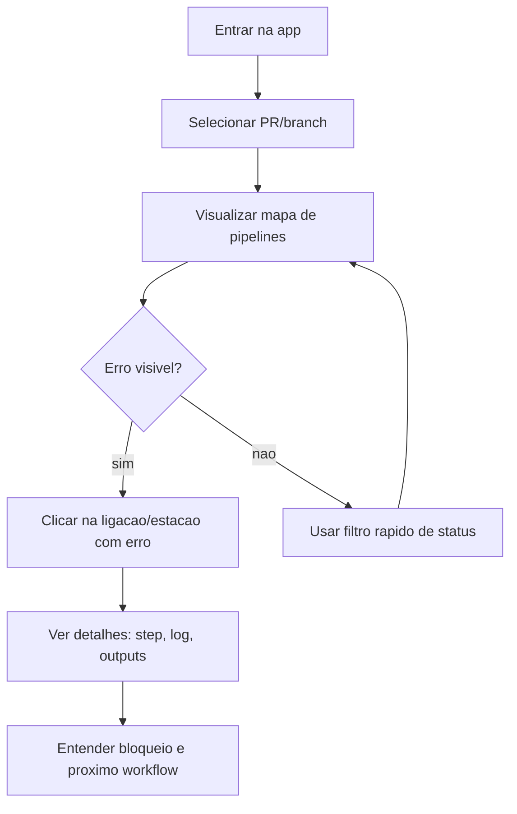
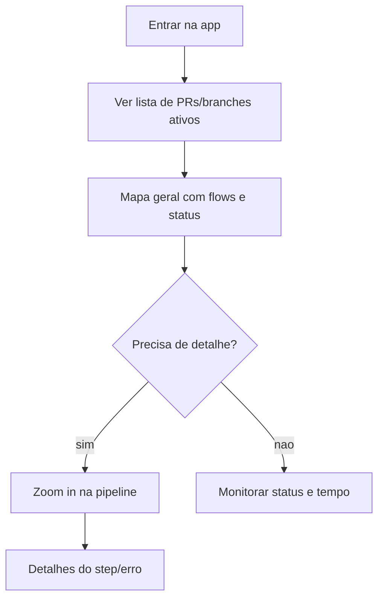

# UX Design Specification {{project_name}}

**Author:** {{user_name}}
**Date:** {{date}}

---

<!-- UX design content will be appended sequentially through collaborative workflow steps -->

## Executive Summary

### Project Vision

Criar uma experiencia visual clara para GitHub Actions que transforme pipelines complexas em um mapa legivel. O objetivo e permitir que developers entendam rapidamente o estado das pipelines, dependencias e falhas, reduzindo tempo de diagnostico.

### Target Users

**Primario:** developers com muitos PRs que precisam de visibilidade imediata do estado das pipelines.
**Secundario:** DevOps, focados em falhas e suas causas para acelerar triagem.

### Key Design Challenges

- Mostrar dependencias entre workflows sem poluir a interface
- Permitir leitura rapida do estado em segundos (zoom out)
- Navegar para o detalhe exato do erro (zoom in) sem perder contexto

### Design Opportunities

- Metafora visual do "mapa de metro" como linguagem primaria
- Zoom progressivo que une visao macro e diagnostico detalhado
- Interacao simples (clique em ligacao) para dados/outputs

## Core User Experience

### Defining Experience

A experiencia central e o usuario abrir a aplicacao web e visualizar imediatamente a pipeline do PR/branch, com todas as dependencias e estados visiveis. O foco e reduzir friccao e tornar a leitura do flow instantanea.

### Platform Strategy

- **Plataforma:** Web
- **Interacao principal:** mouse/teclado
- **Uso tipico:** desktops/laptops durante fluxo de desenvolvimento

### Effortless Interactions

- Visualizar o estado geral sem precisar de filtros
- Entender dependencias sem expandir multiplos paineis
- Ir do macro ao detalhe em 1 clique

### Critical Success Moments

Em menos de 30 segundos, o usuario ve o PR em execucao, identifica o ponto exato de falha e entende o que bloqueia o proximo workflow.

### Experience Principles

- **Clareza em segundos:** o estado deve ser compreendido em <5s
- **Zoom progressivo:** macro simples, micro detalhado
- **Friccao minima:** 1-2 cliques ate o erro
- **Dependencias visiveis:** nada "escondido" por padrao

## Desired Emotional Response

### Primary Emotional Goals

- Leveza (sensacao de simplicidade e clareza)
- Confianca (certeza de onde esta o problema)
- Felicidade apos resolver a falha

### Emotional Journey Mapping

- **Descoberta:** curiosidade e leveza
- **Uso principal:** confianca e controle
- **Apos resolver falha:** alivio e satisfacao
- **Retorno:** expectativa positiva

### Micro-Emotions

- Confianca vs. Confusao
- Satisfacao vs. Frustracao
- Calma vs. Ansiedade

### Design Implications

- Clareza visual imediata para gerar confianca
- Feedback rapido para evitar frustracao
- Linguagem visual leve para reduzir ansiedade
- Enfase no "ponto de falha" para sensacao de controle

### Emotional Design Principles

- Simplicidade primeiro
- Confianca em cada clique
- Friccao minima = leveza maxima

## UX Pattern Analysis & Inspiration

### Inspiring Products Analysis

- **Jenkins Blue Ocean:** leitura linear e visual das pipelines, reduzindo carga cognitiva.
- **GitHub Actions UI:** referencia do que melhorar - falta visao integrada do flow.
- **Linear/Jira:** organizacao clara de estados e prioridade.
- **Figma:** experiencia visual baseada em zoom e contexto.
- **Mapas de metro:** linguagem clara para dependencias e transicoes.

### Transferable UX Patterns

- **Mapa de metro** para dependencias visiveis
- **Zoom progressivo** (estilo Figma) para ir do macro ao detalhe
- **Status visivel** em um olhar (inspirado em Linear/Jira)

### Anti-Patterns to Avoid

- Interfaces que exigem multiplos cliques/filtros
- Excesso de logs antes de mostrar o flow
- UI textual pesada sem hierarquia visual

### Design Inspiration Strategy

**Adotar:** metafora do mapa e zoom progressivo
**Adaptar:** estados claros (Linear/Jira) ao contexto de pipelines
**Evitar:** navegacao fragmentada e excesso de detalhe sem contexto

## Design System Foundation

### 1.1 Design System Choice

**Themeable system baseado em Ant Design**, com possibilidade de componentes custom quando necessario.

### Rationale for Selection

- **Velocidade**: Ant oferece componentes maduros e documentacao solida
- **Flexibilidade**: permite customizacao visual sem sacrificar consistencia
- **Experiencia da equipa**: ja existe familiaridade com Ant

### Implementation Approach

- Usar Ant como base para layout, inputs, navegacao e tabela
- Criar componentes proprios apenas para o "mapa de metro" e zoom
- Definir tokens de cor e tipografia para identidade visual

### Customization Strategy

- Tema leve, claro e focado em legibilidade
- Cores de flows consistentes + bordas/icones para status
- Manter UI limpa, com densidade visual controlada

## 2. Core User Experience

### 2.1 Defining Experience

"Abro o PR e em segundos vejo o fluxo completo das pipelines, com o ponto exato onde falhou."

### 2.2 User Mental Model

O usuario pensa em pipelines como uma sequencia de etapas conectadas; ele espera ver o fluxo inteiro sem precisar abrir logs ou navegar por multiplos menus.

### 2.3 Success Criteria

- Encontra o erro em <30s
- Entende o bloqueio do proximo workflow
- Precisa de <=2 cliques para chegar ao step falhado

### 2.4 Novel UX Patterns

O padrao base e familiar (pipeline como fluxo linear), com inovacao no **mapa visual** e no **zoom progressivo** para ligar macro e detalhe sem friccao.

### 2.5 Experience Mechanics

**1. Initiation:** abre a visao do PR/branch
**2. Interaction:** navega no mapa, clica na ligacao ou estacao
**3. Feedback:** status e erro aparecem imediatamente, com destaque visual
**4. Completion:** usuario entende falha e proximo bloqueio com clareza

## Visual Design Foundation

### Color System

- **Primaria:** #3B82F6 (azul claro, confianca)
- **Neutros:** #F8FAFC / #E2E8F0 / #475569
- **Status:** Sucesso #22C55E, Alerta #F59E0B, Erro #EF4444

### Typography System

- **Primaria:** Manrope (limpa, legivel, moderna)
- **Mono:** JetBrains Mono (IDs, steps, logs)
- **Hierarquia:** titulos claros e corpo leve, foco em leitura rapida

### Spacing & Layout Foundation

- **Base:** 8px (8/16/24/32)
- **Layout:** arejado, alta legibilidade
- **Densidade:** baixa a media (sem poluir o mapa visual)

### Accessibility Considerations

- Contraste minimo AA
- Estados comunicados por **cor + forma** (borda/icone)
- Evitar depender apenas de cor para erro

## Design Direction Decision

### Design Directions Explored

- Direcao 1: Metro-Map Clean (principal)
- Direcao 2: Timeline + Detalhe lateral
- Direcao 6: Map + Table (auditavel)

### Chosen Direction

Direcao 1 como base, com elementos de Direcao 2 (painel de detalhe) e Direcao 6 (tabela auditavel quando necessario).

### Design Rationale

- Mantem clareza visual no mapa principal
- Permite diagnostico rapido com detalhe on-demand
- Oferece opcao auditavel sem poluir o mapa

### Implementation Approach

- Mapa principal como visao default
- Painel lateral de detalhe ao clicar em ligacoes/estacoes
- Tabela auxiliar para logs/outputs quando requisitado

## User Journey Flows

### Diagnostico rapido de falha

**Objetivo:** descobrir o step com erro e entender o bloqueio em <30s.

### Visao geral de pipelines ativas

**Objetivo:** entender rapidamente o estado geral de execucoes.

### Journey Patterns

- Entrada unica: abrir app -> ver status imediato
- Zoom progressivo: macro -> detalhe com 1 clique
- Feedback instantaneo: erro destacado visualmente

### Flow Optimization Principles

- Minimizar passos ate o erro
- Reduzir friccao para diagnostico
- Evitar navegacao fragmentada

## Component Strategy

### Design System Components

Usar Ant Design para:
- Layout, Grid, Card, Tabs
- Table, Tag, Tooltip, Dropdown
- Buttons, Icons, Breadcrumb
- Drawer/Panel para detalhes
- Progress, Badge, Alert, Empty

### Custom Components

#### Pipeline Map
**Purpose:** mapa principal de fluxos
**Usage:** visao macro do PR/branch
**States:** normal, erro, cancelado
**Accessibility:** navegacao por teclado e foco visivel

#### Flow Line + Stations
**Purpose:** representar jobs/steps
**States:** ok, warning, error
**Variants:** horizontal/compact
**Interaction:** hover/click com tooltip

#### Dependency Connector
**Purpose:** mostrar transicoes entre workflows
**Usage:** estacao de transbordo
**States:** waiting, ready, blocked

#### Status Overlay
**Purpose:** destacar erros e bloqueios
**Interaction:** visual + tooltip

#### Zoom Controller
**Purpose:** macro <-> detalhe
**Variants:** slider + botao zoom

#### Flow Detail Panel
**Purpose:** mostrar logs/outputs/artefatos
**States:** empty, loading, error
**Interaction:** tabs + copy

### Component Implementation Strategy

- Baseado em tokens do Ant
- Custom components apenas onde necessario
- Acessibilidade por padrao

### Implementation Roadmap

**Phase 1:** Pipeline Map, Flow Line, Status Overlay
**Phase 2:** Flow Detail Panel, Dependency Connector
**Phase 3:** Zoom Controller, extras

## UX Consistency Patterns

### Button Hierarchy

- **Primary:** acoes criticas (abrir detalhe, zoom)
- **Secondary:** filtros, export, refresh
- **Danger:** acoes destrutivas (re-run/cancel)

### Feedback Patterns

- **Erro:** borda vermelha + icone + tooltip
- **Warning:** amarelo com texto de apoio
- **Success:** verde discreto + check
- **Info:** azul neutro para estado

### Navigation Patterns

- **Mapa principal** como navegacao default
- **Painel lateral** abre por clique
- **Tabela auditavel** como visao complementar

### Empty/Loading States

- **Empty:** mensagem clara + sugestao de acao
- **Loading:** skeleton + progresso real

### Search/Filter Patterns

- Filtro por PR/branch/status
- Busca rapida no topo
- Chips para filtros ativos

## Responsive Design & Accessibility

### Responsive Strategy

- **Desktop-first**, com layout amplo e painel lateral
- **Tablet** com layout simplificado e toque otimizado
- **Mobile**: suporte basico (nao foco do MVP)

### Breakpoint Strategy

- **Mobile:** 320-767
- **Tablet:** 768-1023
- **Desktop:** 1024+
- Foco em desktop e tablet, com ajustes minimos para mobile

### Accessibility Strategy

- **WCAG AA** como padrao
- Contraste minimo 4.5:1
- Navegacao por teclado completa
- Estados comunicados por cor + forma

### Testing Strategy

- Testes em Chrome/Firefox/Safari/Edge
- Testes de teclado-only
- Simulacao de daltonismo
- Verificacao com Lighthouse/axe

### Implementation Guidelines

- Unidades relativas (rem, %)
- Touch targets >= 44px
- ARIA labels em componentes custom
- Focus states visiveis

